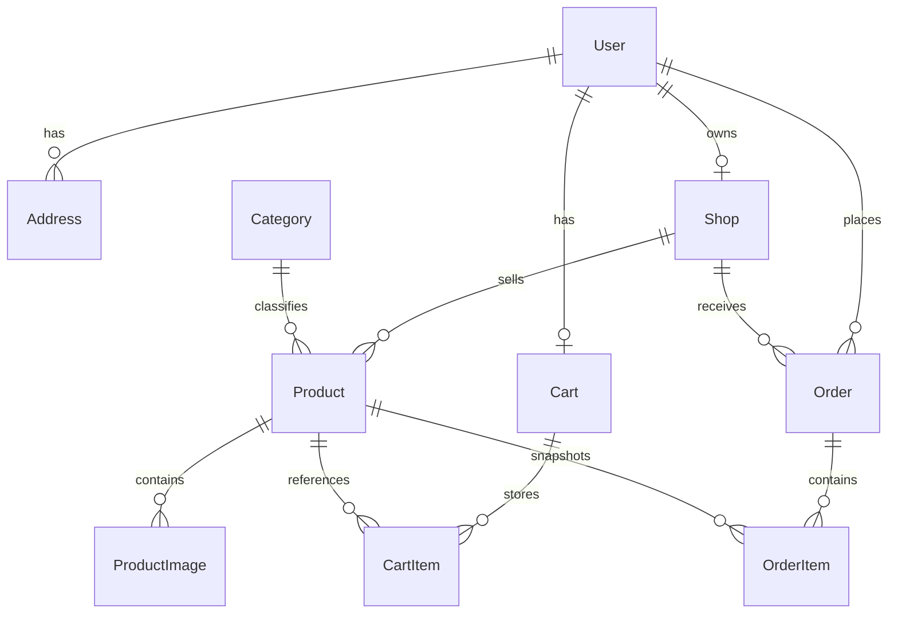

# Base de donnees

## Moteur

- PostgreSQL 16
- Prisma ORM

## Principales entites

### `User`

- Porte les informations d'identite
- Role: `BUYER`, `SELLER`, `ADMIN`
- Possede zero ou une boutique
- Possede un panier et plusieurs commandes

### `Address`

- Adresse rattachee a un utilisateur
- Utilisee lors du checkout

### `Shop`

- Boutique d'un vendeur
- Statut: `PENDING`, `APPROVED`, `SUSPENDED`

### `Category`

- Classification produit

### `Product`

- Produit vendable
- Prix stocke en centimes
- Statut: `DRAFT`, `PUBLISHED`, `SUSPENDED`

### `ProductImage`

- URLs des images associees au produit

### `Cart` et `CartItem`

- Panier persistant par utilisateur
- Quantites et references produits

### `Order` et `OrderItem`

- Une commande par boutique lors du checkout
- Snapshot d'adresse et snapshot produit

## Relations

## Choix de modelisation

- Le prix est stocke en centimes pour eviter les erreurs d'arrondi.
- La commande conserve un `shippingSnapshot` pour garder l'etat exact de l'adresse au moment de l'achat.
- La commande conserve aussi un snapshot du nom, prix et visuel produit.
- Une boutique est unique par vendeur pour simplifier le MVP d'evaluation.

## Indices utiles

- `Product.status`
- `Product.shopId`
- `Product.categoryId`
- `Order.buyerId`
- `Order.shopId`
- `Address.userId`

## Migrations

Le schema est versionne avec Prisma Migrate dans `backend/prisma/migrations`.

- developpement : `npm run prisma:migrate` (cree et applique une migration)
- CI / Docker / production : `npx prisma migrate deploy`

Une base creee historiquement avec `prisma db push` ne possede pas de table
`_prisma_migrations` et doit etre baselinee une fois avec
`npx prisma migrate resolve --applied <nom_migration>`.

## Integrite et concurrence

Le decrement de stock au checkout est protege par une garde conditionnelle
(`updateMany` avec `stock >= quantite`), executee dans la transaction de
creation des commandes. Si aucune ligne ne correspond, la transaction est
annulee et l'API renvoie `409 Insufficient stock` : deux checkouts simultanes
ne peuvent pas faire passer le stock en negatif.

## Seed data livrees

- 1 admin
- 1 seller
- 1 buyer
- 3 categories
- 1 boutique approuvee
- 16 produits publies repartis sur les trois categories
- 1 adresse buyer par defaut
